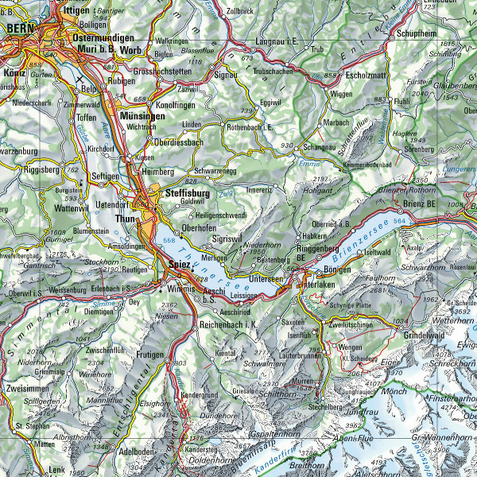
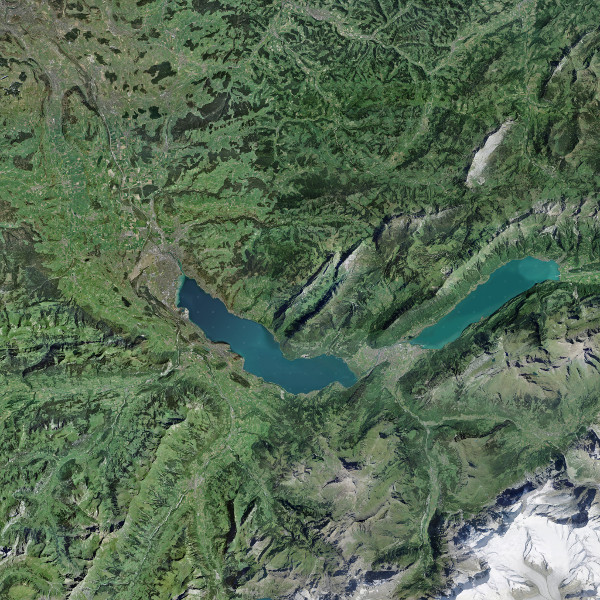
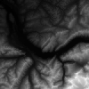
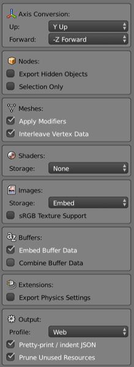

# Virtual Reality with JavaScript

Demos presented at the Client Technology Days 2017 at Zuehlke / Bärner JS Talks 2018.

## Zuehlke cubes

[](https://youtu.be/4YESNrei7Q0)

[Video](https://youtu.be/4YESNrei7Q0) | [Demo](https://lakermann.github.io/vr-with-javascript/zuehlke-cubes.html)

### Cubes components

* A-Frame: Framework & tracked controllers ([license](../master/docs/LICENSE-aframe.txt))

### Cubes references

* A-Frame: Tracked Controllers Demo, <https://aframe.io/examples/showcase/tracked-controllers/>
* A-Frame: Tracked Controllers Source, <https://github.com/aframevr/aframe/tree/master/examples/showcase/tracked-controls>

## Zuehlke bowling

[](https://youtu.be/LJ9yajf34Vs)

[Video](https://youtu.be/LJ9yajf34Vs) | [Demo](https://lakermann.github.io/vr-with-javascript/zuehlke-bowling.html)

### Bowling components

* A-Frame: Framework & tracked controllers ([license](../master/docs/LICENSE-aframe.txt))

### Bowling references

* A-Frame: Ball Throw Source, <https://github.com/bryik/aframe-ball-throw/>

## Paraglider simulator

[](https://youtu.be/H3w2yMeqeMI)

[Sky (demo)](https://lakermann.github.io/vr-with-javascript/paraglider-sky.html) | [Terrain (demo)](https://lakermann.github.io/vr-with-javascript/paraglider-terrain.html) | [Paraglider (demo)](https://lakermann.github.io/vr-with-javascript/paraglider-paraglider.html) | [Animation (demo)](https://lakermann.github.io/vr-with-javascript/paraglider-animation.html) | [Final version (video)](https://www.youtube.com/watch?v=H3w2yMeqeMI)

### Paraglider components

* A-Frame: Framework ([license](../master/docs/LICENSE-aframe.txt))
* A-Frame: Terrain model component ([license](../master/docs/LICENSE-aframe-terrain-model-component.txt))
* Sky Box: KIIRA ([license](../master/docs/LICENSE-skybox.txt))
* Texture: Federal Office of Topography swisstopo ([license](../master/docs/LICENSE-texture.txt))
* Digital height model: Federal Office of Topography swisstopo ([license](../master/docs/LICENSE-dhm200.txt))
* Paraglider: Raphael T. ([license](../master/docs/LICENSE-paraglider.txt))

### Terrain

Swiss coordinate system (Swiss grid, 50 km \* 50 km):

             600000             650000

    200000      --------------------
                | Bernese Oberland |
    150000      --------------------



Source: Federal Office of Topography swisstopo

#### Texture

Capture texture with pageres-cli:

```bash
npm install --global pageres-cli

echo '<iframe src="https://map.geo.admin.ch/?lang=en&topic=ech&bgLayer=ch.swisstopo.pixelkarte-farbe&layers=ch.swisstopo.zeitreihen,ch.bfs.gebaeude_wohnungs_register,ch.bav.haltestellen-oev,ch.swisstopo.swisstlm3d-wanderwege,KML%7C%7Chttps:%2F%2Fpublic.geo.admin.ch%2F5c6-b9EHQVmec5USXnC42Q&layers_visibility=false,false,false,false,false&X=175000&Y=625000&zoom=6.8&layers_timestamp=18641231" width="100%" height="100%"></iframe>' > DHM200_bernese_oberland_colour.html

echo '<iframe src="https://map.geo.admin.ch/?lang=en&topic=ech&bgLayer=ch.swisstopo.swissimage&layers=ch.swisstopo.zeitreihen,ch.bfs.gebaeude_wohnungs_register,ch.bav.haltestellen-oev,ch.swisstopo.swisstlm3d-wanderwege,KML%7C%7Chttps:%2F%2Fpublic.geo.admin.ch%2F5c6-b9EHQVmec5USXnC42Q&layers_visibility=false,false,false,false,false&X=175000&Y=625000&zoom=6.8&layers_timestamp=18641231" width="100%" height="100%"></iframe>' > DHM200_bernese_oberland_satellite.html

pageres DHM200_bernese_oberland_colour.html 9999x9999 --delay 600

pageres DHM200_bernese_oberland_satellite.html 9999x9999 --delay 600
```

Overlay the two images using an image manipulation program. Crop the satellite image according to the coordinates of the coloured image and resize image to 4096 x 4096 pixels.



Source: Federal Office of Topography swisstopo

#### Elevation model

Get the digital height model DHM25 with 200m grid of swisstopo. Install the Geospatial Data Abstraction Library to translate the height model.

Extract bernese oberland:

```bash
gdal_translate DHM200.asc DHM200.tif

gdalwarp -te 600000 150000 650000 200000 DHM200.tif DHM200_bernese_oberland.tif
```

Get min/max height of the extracted model:

```bash
$ gdalinfo -mm DHM200_bernese_oberland.tif
Driver: GTiff/GeoTIFF
Files: DHM200_bernese_oberland.tif
Size is 250, 250
Coordinate System is `'
Origin = (600000.000000000000000,200000.000000000000000)
Pixel Size = (200.000000000000000,-200.000000000000000)
Image Structure Metadata:
  INTERLEAVE=BAND
Corner Coordinates:
Upper Left  (  600000.000,  200000.000)
Lower Left  (  600000.000,  150000.000)
Upper Right (  650000.000,  200000.000)
Lower Right (  650000.000,  150000.000)
Center      (  625000.000,  175000.000)
Band 1 Block=250x8 Type=Float32, ColorInterp=Gray
    Computed Min/Max=499.802,4099.106
  NoData Value=-9999
```

Create a PNG/BIN where the height values are reduced to 256 shades of gray using min/max height.

```bash
gdal_translate -scale 499 4100 0 255 -ot Byte -outsize 100 100 -of PNG DHM200_bernese_oberland.tif DHM200_bernese_oberland.png

gdal_translate -scale 499 4100 0 65535 -ot UInt16 -outsize 100 100 -of ENVI DHM200_bernese_oberland.tif DHM200_bernese_oberland.bin
```



Source: Federal Office of Topography swisstopo

| Property                           | Reality  | A-Frame            |
| ---------------------------------- | -------- | ------------------ |
| Width                              | 50'000 m | planeWidth: 5000   |
| Height                             | 50'000 m | planeHeight: 5000  |
| Width of elevation grid minus one  |          | segmentsWidth: 99  |
| Height of elevation grid minus one |          | segmentsHeight: 99 |
| Vertical exaggeration (1)          |          | zPosition: 370     |

(1) Get value with reference points `First`, `Interlaken`, `Jungfrau` and `Niesen` using visual inspector of A-Frame.

### Paraglider

Get a paraglider model from a 3D warehouse and adapt it with Blender. Add Blendergltf add-on to Blender that adds the ability to export to the glTF format.

Select model and export as gltf:



| Property        | Reality | A-Frame                |
| --------------- | ------- | ---------------------- |
| Span, projected | 8.8 m   | scale="0.88 0.88 0.88" |

### Final version

The final version in the video includes additional menus, collision detection (using raycasts), gaze-based interaction, support for HTC Vive controllers and a state machine.

#### Positioning

Position of the terrain model:

| Property | A-Frame                      |
| -------- | ---------------------------- |
| Position | position="2500 50 -2500" (1) |

(1) Get value of y-axis with reference point `Bern` using visual inspector of A-Frame.

#### Convert coordinates

| A-Frame axis | Calculation                                     |
| ------------ | ----------------------------------------------- |
| X            | (Swiss coordinate system Y - 600000) / 10       |
| Y            | Height m ü. M. / 10                             |
| Z            | (Swiss coordinate system X - 150000) / 10 \* -1 |

#### Reference points

| Name       | Swiss coordinate system (Y/X) | Height m ü. M. | A-Frame                         |
| ---------- | ----------------------------- | -------------- | ------------------------------- |
| Bern       | 600670 / 199655               | 542 m ü. M.    | position="67 54.2 -4965.5"      |
| First      | 647151 / 167915               | 2167 m ü. M.   | position="4715.1 216.7 -1791.5" |
| Interlaken | 632746 / 170323               | 568 m ü. M.    | position="3274.6 56.8 -2032.3"  |
| Jungfrau   | 640278 / 154213               | 4158 m ü. M.   | position="4027.8 415.8 -421.3"  |
| Niesen     | 616373 / 166119               | 2362 m ü. M.   | position="1637.3 236.2 -1611.9" |

### Paraglider references

* aframe-terrain-model-component, <https://github.com/bryik/aframe-terrain-model-component>
* Sky Box - Sunny Day, <https://opengameart.org/content/sky-box-sunny-day>
* Maps of Switzerland, <https://map.geo.admin.ch/>
* Digital height model DHM25, <https://shop.swisstopo.admin.ch/en/products/height_models/dhm25200>
* Sigma paraglide by advance, <https://3dwarehouse.sketchup.com/collection/c166a0a48065f4403a426bad1ca64772/real-life-paraglides>
* Swiss coordinate system, <https://en.wikipedia.org/wiki/Swiss_coordinate_system>
* pageres-cli, <https://github.com/sindresorhus/pageres-cli>
* GDAL - Geospatial Data Abstraction Library, <http://www.gdal.org>
* Converting terrain data to a WebGL-friendly format, <http://blog.mastermaps.com/2013/10/terrain-building-with-threejs-part-1.html>
* Blender, <https://www.blender.org>
* Blendergltf, <https://github.com/Kupoman/blendergltf>
* Javascript State Machine, <https://github.com/jakesgordon/javascript-state-machine>
* Meter über Meer, <https://de.wikipedia.org/wiki/Meter_%C3%BCber_Meer>
* Bern, <https://de.wikipedia.org/wiki/Bern>
* First, <https://de.wikipedia.org/wiki/First_(Berg)>
* Interlaken, <https://de.wikipedia.org/wiki/Interlaken>
* Jungfrau, <https://de.wikipedia.org/wiki/Jungfrau_(Berg)>
* Niesen, <https://de.wikipedia.org/wiki/Niesen_(Berg)>
